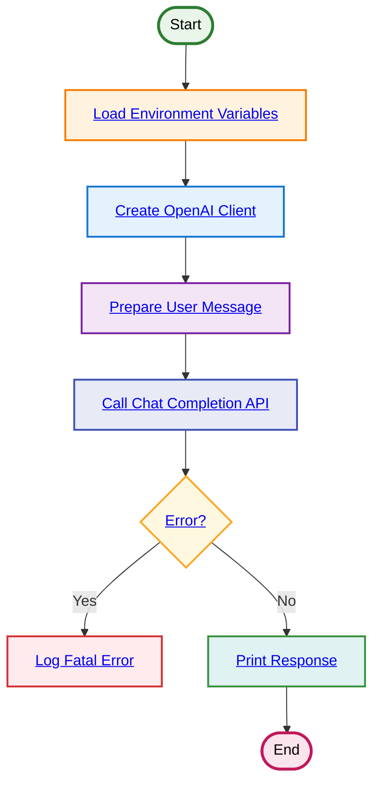

# Simple OpenAI Completion

**Flow Summary:**
1. **Load Environment**: Get `MODEL_RUNNER_BASE_URL` and `COOK_MODEL`
2. **Create Client**: Initialize OpenAI client with custom base URL
3. **Prepare Message**: Set user message "Quel est ton nom?"
4. **API Call**: Execute chat completion with temperature 0.5
5. **Error Check**: Handle any API errors
6. **Output**: Print the AI response