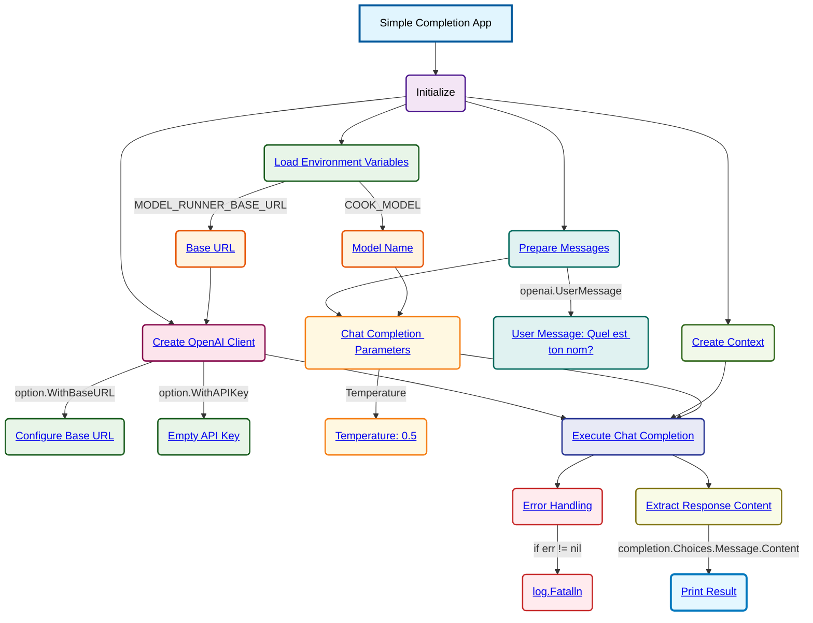

# Simple OpenAI Completion Schema

**Key Components:**

- **Environment Variables**:
  - `MODEL_RUNNER_BASE_URL`: Base URL for the Docker Model Runner
  - `COOK_MODEL`: Model identifier to use for completion

- **OpenAI Client Configuration**:
  - Base URL configured from environment variable
  - Empty API key (using local model runner)

- **Chat Completion Parameters**:
  - Message: "Quel est ton nom?" (French for "What is your name?")
  - Model: From environment variable
  - Temperature: 0.5

- **Execution Flow**:
  1. Load environment variables
  2. Create OpenAI client with custom base URL
  3. Prepare chat completion parameters
  4. Execute completion request
  5. Handle errors and print response