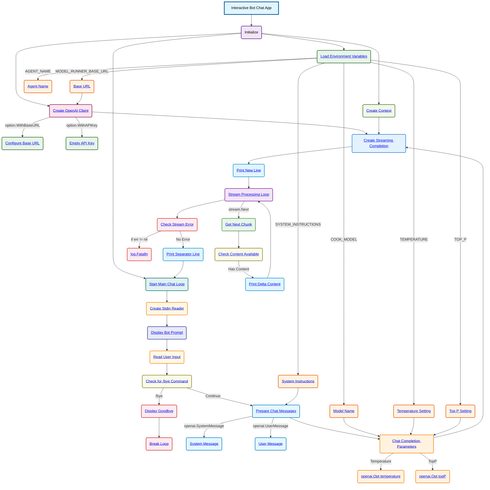

# Interactive Bot Chat Schema

**Key Components:**

- **Environment Variables**:
  - `MODEL_RUNNER_BASE_URL`: Base URL for the Docker Model Runner
  - `COOK_MODEL`: Model identifier to use for completion
  - `TEMPERATURE`: Controls randomness in responses (parsed as float64)
  - `TOP_P`: Controls nucleus sampling (parsed as float64)
  - `AGENT_NAME`: Display name for the bot in prompts
  - `SYSTEM_INSTRUCTIONS`: System message defining bot behavior

- **OpenAI Client Configuration**:
  - Base URL configured from environment variable
  - Empty API key (using local model runner)

- **Interactive Chat Loop**:
  - Continuous loop for user interaction
  - Stdin reader for user input capture
  - Dynamic prompt showing agent name and model
  - Exit command `/bye` to terminate session

- **Message System**:
  - System Message: From `SYSTEM_INSTRUCTIONS` environment variable
  - User Message: Real-time input from user

- **Streaming Parameters**:
  - Model: From environment variable
  - Temperature: Dynamic from environment
  - TopP: Dynamic from environment

- **Interactive Flow**:
  1. Load all environment variables and parse numeric values
  2. Create OpenAI client with custom base URL
  3. Enter continuous chat loop
  4. Display interactive prompt with agent name and model
  5. Read user input from stdin
  6. Check for exit command (`/bye`)
  7. Prepare system and user messages
  8. Configure streaming completion parameters
  9. Create streaming completion request
  10. Process stream chunks in real-time
  11. Print each content delta as it arrives
  12. Display separator and continue loop
  13. Handle stream errors and exit conditions

**Interactive Features**:
- **Continuous conversation**: Loop allows multiple exchanges
- **Real-time streaming**: Responses appear as they're generated
- **Configurable agent**: Agent name and behavior via environment
- **Clean exit**: `/bye` command for graceful termination
- **Visual separation**: Dashed lines between conversation turns