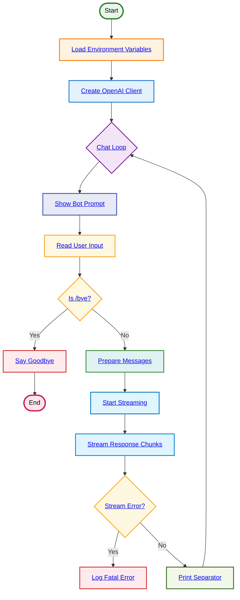

# Interactive Bot Chat

**Flow Summary:**
1. **Load Environment**: Get all configuration (URL, model, agent name, instructions, temperature, top_p)
2. **Create Client**: Initialize OpenAI client with custom configuration
3. **Chat Loop**: Enter continuous conversation mode
4. **Show Prompt**: Display bot name and model in interactive prompt
5. **Read Input**: Get user message from stdin
6. **Check Exit**: Look for `/bye` command to exit
7. **Prepare Messages**: Create system + user message pair
8. **Start Stream**: Begin streaming completion request
9. **Stream Chunks**: Output response in real-time as it's generated
10. **Error Check**: Handle any streaming errors
11. **Print Separator**: Add visual break between conversations
12. **Loop Back**: Return to prompt for next interaction

**Key Features:**
- **Interactive Loop**: Continuous conversation until `/bye`
- **Real-time Streaming**: Responses appear as they're generated
- **Configurable Agent**: Name and behavior from environment variables
- **Clean Exit**: Graceful termination with goodbye message