# Interactive Bot with Memory

```mermaid
flowchart TD
    Start([Start]):::start

    Start --> LoadEnv[<a href="/104-bot-memory/main.go#L19">Load Environment Variables</a>]:::config

    LoadEnv --> CreateClient[<a href="/104-bot-memory/main.go#L22">Create OpenAI Client</a>]:::client

    CreateClient --> InitMemory[<a href="/104-bot-memory/main.go#L36">Initialize Memory with System Message</a>]:::memory

    InitMemory --> ChatLoop{<a href="/104-bot-memory/main.go#L40">Chat Loop</a>}:::loop

    ChatLoop --> ShowPrompt[<a href="/104-bot-memory/main.go#L42">Show Bot Prompt 🤖🧠</a>]:::prompt

    ShowPrompt --> ReadInput[<a href="/104-bot-memory/main.go#L43">Read User Input</a>]:::input

    ReadInput --> CheckCommands{<a href="/104-bot-memory/main.go#L45">Check Commands</a>}:::decision

    CheckCommands -->|/bye| Goodbye[<a href="/104-bot-memory/main.go#L46">Say Goodbye</a>]:::exit

    Goodbye --> EndNode([End]):::final

    CheckCommands -->|/memory| ShowMemory[<a href="/104-bot-memory/main.go#L51">Display Conversation History</a>]:::memory

    ShowMemory --> ChatLoop

    CheckCommands -->|Regular Message| AddToMemory[<a href="/104-bot-memory/main.go#L56">Add User Message to Memory</a>]:::memory

    AddToMemory --> SendWithHistory[<a href="/104-bot-memory/main.go#L58">Send Request with Full History</a>]:::api

    SendWithHistory --> StreamResponse[<a href="/104-bot-memory/main.go#L71">Stream Response & Accumulate</a>]:::stream

    StreamResponse --> SaveResponse[<a href="/104-bot-memory/main.go#L87">Save Assistant Response to Memory</a>]:::memory

    SaveResponse --> PrintSeparator[<a href="/104-bot-memory/main.go#L89">Print Separator</a>]:::separator

    PrintSeparator --> ChatLoop

    classDef start fill:#e8f5e8,stroke:#2e7d32,stroke-width:3px,color:#000
    classDef config fill:#fff3e0,stroke:#f57c00,stroke-width:2px,color:#000
    classDef client fill:#e3f2fd,stroke:#1976d2,stroke-width:2px,color:#000
    classDef memory fill:#fff3e0,stroke:#ff6f00,stroke-width:3px,color:#000
    classDef loop fill:#f3e5f5,stroke:#7b1fa2,stroke-width:2px,color:#000
    classDef prompt fill:#e8eaf6,stroke:#3f51b5,stroke-width:2px,color:#000
    classDef input fill:#fff8e1,stroke:#f9a825,stroke-width:2px,color:#000
    classDef decision fill:#fff8e1,stroke:#f9a825,stroke-width:2px,color:#000
    classDef exit fill:#ffebee,stroke:#d32f2f,stroke-width:2px,color:#000
    classDef final fill:#fce4ec,stroke:#c2185b,stroke-width:3px,color:#000
    classDef api fill:#e0f2f1,stroke:#388e3c,stroke-width:2px,color:#000
    classDef stream fill:#e1f5fe,stroke:#0277bd,stroke-width:2px,color:#000
    classDef separator fill:#f1f8e9,stroke:#33691e,stroke-width:2px,color:#000
```

**Flow Summary:**
1. **Load Environment**: Get configuration (URL, model, agent name, instructions, etc.)
2. **Create Client**: Initialize OpenAI client
3. **Initialize Memory**: Start with system message in conversation history
4. **Chat Loop**: Enter continuous conversation mode with memory
5. **Show Prompt**: Display enhanced prompt with brain emoji (🤖🧠)
6. **Read Input**: Get user message from stdin
7. **Check Commands**: Handle special commands or regular messages
   - **`/bye`**: Exit gracefully
   - **`/memory`**: Show full conversation history
   - **Regular message**: Process normally
8. **Add to Memory**: Append user message to conversation history
9. **Send with History**: Include entire conversation in API request
10. **Stream Response**: Get streaming response while accumulating content
11. **Save Response**: Store complete assistant response in memory
12. **Print Separator**: Add visual break and loop back

**Key Memory Features:**
- **🧠 Persistent Memory**: Conversation history maintained throughout session
- **Context Awareness**: Each request includes full conversation context
- **Memory Inspection**: `/memory` command shows conversation log
- **Complete Responses**: Streaming responses fully captured and stored
- **Continuous Learning**: Bot remembers all previous exchanges

**Difference from Basic Bot:**
- **Memory persistence** vs. single exchange
- **Context accumulation** vs. isolated messages
- **Conversation history** available for inspection
