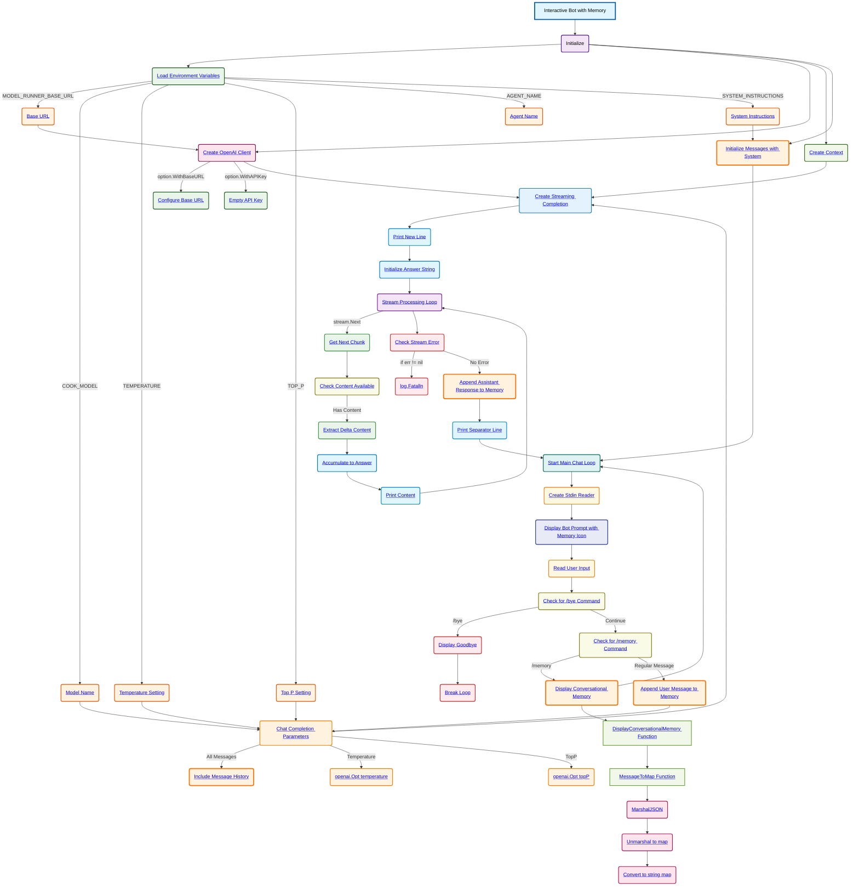

# Interactive Bot with Memory Schema

**Key Components:**

- **Environment Variables**:
  - `MODEL_RUNNER_BASE_URL`: Base URL for the Docker Model Runner
  - `COOK_MODEL`: Model identifier to use for completion
  - `TEMPERATURE`: Controls randomness in responses (parsed as float64)
  - `TOP_P`: Controls nucleus sampling (parsed as float64)
  - `AGENT_NAME`: Display name for the bot in prompts
  - `SYSTEM_INSTRUCTIONS`: System message defining bot behavior

- **Memory Management**:
  - **Persistent Message History**: Messages slice maintains entire conversation
  - **System Message**: Initial system instructions stored in memory
  - **User Messages**: Each user input appended to conversation history
  - **Assistant Messages**: Complete responses accumulated and stored
  - **Memory Display**: `/memory` command shows full conversation history

- **OpenAI Client Configuration**:
  - Base URL configured from environment variable
  - Empty API key (using local model runner)

- **Interactive Chat Loop**:
  - Continuous loop for user interaction with memory persistence
  - Enhanced prompt with brain emoji indicating memory capability
  - Memory inspection via `/memory` command
  - Exit command `/bye` to terminate session

- **Response Processing**:
  - **Content Accumulation**: Full assistant response collected during streaming
  - **Memory Storage**: Complete response added to conversation history
  - **Real-time Display**: Content streamed to user as generated

- **Memory Functions**:
  - **`MessageToMap`**: Converts OpenAI messages to readable map format
  - **`DisplayConversationalMemory`**: Shows formatted conversation history
  - **JSON Conversion**: Marshal/unmarshal for message processing

**Memory Features**:
1. **Conversation Persistence**: All messages (system, user, assistant) stored
2. **Context Awareness**: Each request includes full conversation history
3. **Memory Inspection**: `/memory` command displays conversation log
4. **Response Accumulation**: Streaming responses fully captured for storage
5. **Continuous Context**: Bot remembers previous exchanges throughout session

**Interactive Flow**:
1. Initialize with system message in memory
2. Enter continuous chat loop with memory persistence
3. Handle special commands (`/bye`, `/memory`)
4. Append user messages to conversation history
5. Include full message history in API requests
6. Stream and accumulate assistant responses
7. Store complete assistant responses in memory
8. Maintain conversation context across interactions