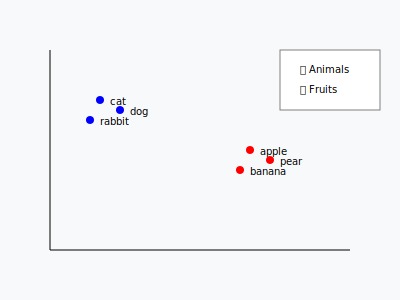

# Embedding ? 🤨

An embedding = transforming data (e.g.: text) into vectors of numbers. 

---
## Mathematical representation

Giving "coordinates" to data to place them in a mathematical space where:
- **Similar** elements are **close**
- **Different** elements are **distant**

---

---
## Usefulness

**Semantic search**
- Find similar documents
- Search for similar images 
- Recommend similar products
- ...

<!--
mathematical representation of the semantic meaning of a text
-->>