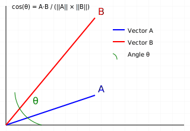

# Cosine Distance between 2 vectors

- **Cosine distance** measures the **similarity** between two vectors by calculating the cosine of the angle separating them.
- The more similar the vectors are, the closer the cosine will be to 1.

---
## Key points

- The distance ranges between `-1` and `1`
- `1` means the vectors are identical (same direction)
- `-1` means they point in opposite directions

