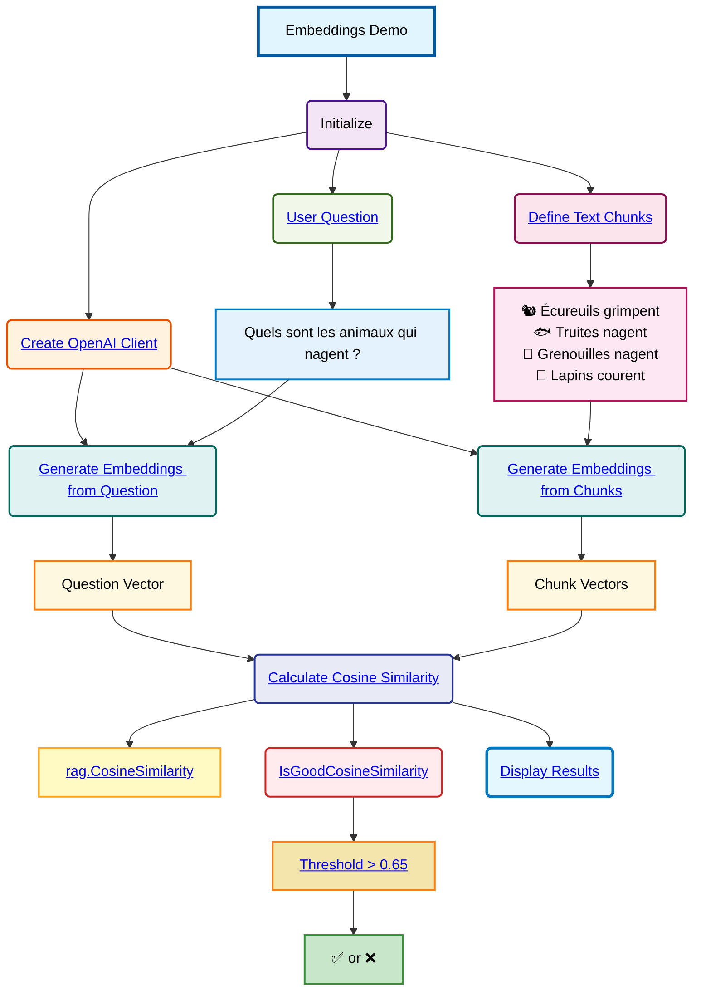

# Embeddings and Cosine Similarity Demo Schema

## Processus détaillé

### 1. Initialisation
- **Client OpenAI** : Création d'un client OpenAI avec l'URL de base personnalisée et une clé API vide

### 2. Données de test
- **Chunks prédéfinis** : 4 phrases décrivant des animaux et leurs actions :
  - Écureuils qui grimpent
  - Truites qui nagent
  - Grenouilles qui nagent
  - Lapins qui courent
- **Question utilisateur** : "Quels sont les animaux qui nagent ?"

### 3. Génération des embeddings
- **Embedding de la question** : Conversion de la question en vecteur numérique
- **Embeddings des chunks** : Conversion de chaque chunk en vecteur numérique

### 4. Calcul de similarité
- **Similarité cosinus** : Utilise `rag.CosineSimilarity()` pour comparer le vecteur de la question avec chaque vecteur de chunk
- **Évaluation** : Fonction `IsGoodCosineSimilarity()` qui retourne ✅ si similarité > 0.65, sinon ❌

### 5. Résultats attendus
Les chunks contenant "nagent" (truites et grenouilles) devraient avoir une similarité cosinus élevée avec la question sur les animaux qui nagent.

**Fonctions clés :**
- `main()` : Point d'entrée principal
- `IsGoodCosineSimilarity()` : Évaluation du seuil de similarité
- `rag.CosineSimilarity()` : Calcul de la similarité cosinus (fonction externe)