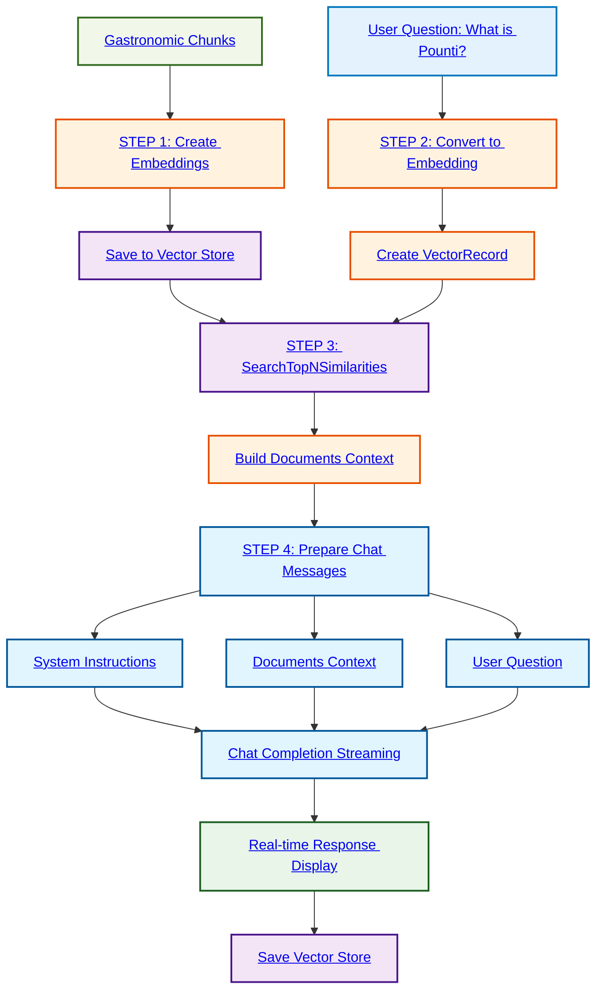

# Complete RAG - Embeddings + Chat Completion
> RAG from scratch

## Basic Principle

This program demonstrates a complete **RAG (Retrieval-Augmented Generation)** system that combines similarity search using embeddings with response generation using a chat model. It processes data about Auvergne gastronomy.

## Flow Diagram



## How it Works

```
Question: "Explique moi ce qu'est le Pounti ?"
    ↓
STEP 1: Create embeddings for Auvergne dishes
• Truffade → VectorRecord
• Aligot → VectorRecord
• Pounti → VectorRecord ← Exact match ✅
• Cantal → VectorRecord
    ↓
STEP 2: Convert question to embedding
    ↓
STEP 3: Search for similarity in vector store
→ Finds "Pounti" chunk with high similarity
    ↓
STEP 4: Build context for chat
• System instructions (SYSTEM_INSTRUCTIONS)
• Relevant documents found
• Original user question
    ↓
Chat Completion with streaming → Real-time response generation
```

## Key Concepts

- **RAG (Retrieval-Augmented Generation)**: Combination of vector search + text generation
- **Embeddings Model**: Model to convert text into numerical vectors
- **Chat Model**: Language model to generate final responses
- **Streaming Response**: Real-time response display chunk by chunk
- **System Instructions**: Instructions given to the model to guide its responses
- **Context Window**: Relevant documents provided to the model as context

## Configuration via Environment Variables

- `MODEL_RUNNER_BASE_URL`: Model server URL
- `EMBEDDING_MODEL`: Embeddings model to use
- `COOK_MODEL`: Chat model for responses
- `SYSTEM_INSTRUCTIONS`: System instructions for model behavior
- `TEMPERATURE`: Response creativity (0.0-1.0)
- `TOP_P`: Response diversity control
- `SIMILARITY_LIMIT`: Minimum similarity threshold
- `SIMILARITY_MAX_RESULTS`: Maximum number of documents to retrieve

## Complete RAG Flow

1. **Preparation**: Create embeddings for all documents
2. **Indexing**: Store in vector store with unique identifiers
3. **Query**: Convert user question to embedding
4. **Search**: Identify most relevant documents
5. **Augmentation**: Build enriched context for the model
6. **Generation**: Produce response based on context and question
7. **Persistence**: Save vector store for reuse

## Expected Result

For the Pounti question, the system should:
1. Identify the chunk describing Pounti as most relevant
2. Use this context to generate a complete and accurate response
3. Display the response in streaming for smooth user experience
4. Save the vector store to `vectorstore.json`

## Purpose

This system illustrates a production-ready RAG pipeline, capable of answering complex questions by leveraging a specialized knowledge base (here Auvergne gastronomy).