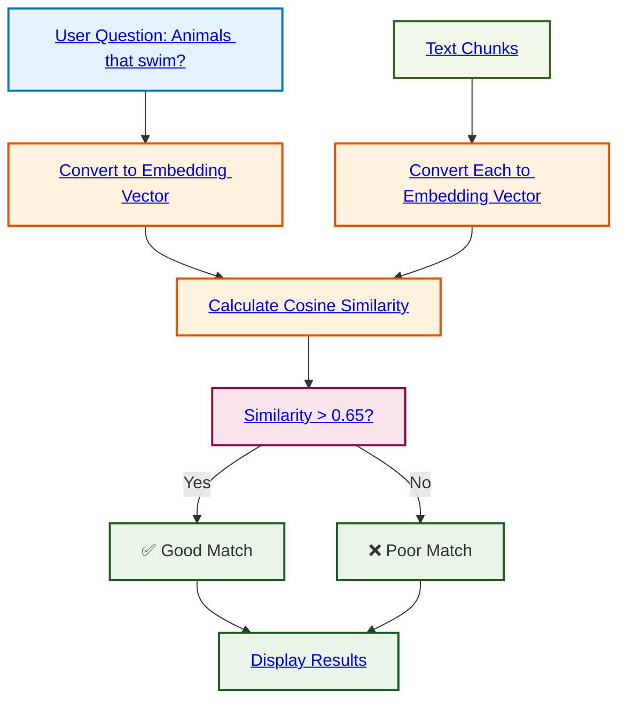

# Embeddings Demo - RAG from Scratch

## Basic Principle

This program demonstrates how to use **embeddings** to find similarities between a search text and a collection of documents.

## Flow Diagram



## How it Works

```
Question: "Quels sont les animaux qui nagent ?"
    ↓
Convert to numerical vector (embedding)
    ↓
Compare with embeddings of each chunk:
• "Les écureuils grimpent dans les arbres"
• "Les truites nagent dans la rivière" ← High similarity ✅
• "Les grenouilles nagent dans l'étang" ← High similarity ✅
• "Les lapins courent dans le champ"
    ↓
Calculate cosine similarity for each chunk
    ↓
Display results with ✅/❌ based on threshold (0.65)
```

## Key Concepts

- **Embedding**: Converting text into a numerical vector that captures its meaning
- **Cosine Similarity**: Measure of proximity between two vectors (0 = different, 1 = identical)
- **Threshold**: Limit value (0.65) to determine if two texts are similar

## Expected Result

Sentences containing the word "nagent" (swim) should have high similarity with the question about swimming animals, while others will have lower similarity.

## Purpose

This technique is the foundation of **RAG (Retrieval-Augmented Generation)**: finding the most relevant documents before generating a response.