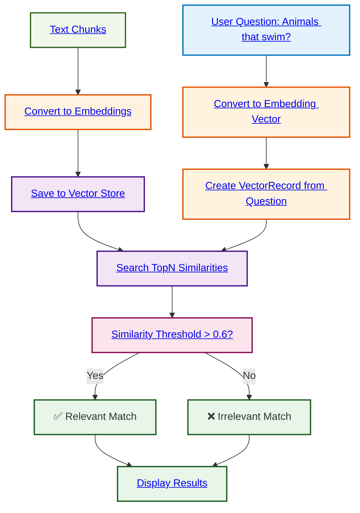

# Embeddings demo with Vector Store
> RAG from Scratch

## Basic Principle

This program demonstrates the use of **embeddings** with an in-memory **vector store** to find similarities between a user question and a collection of documents, then retrieve the most relevant documents.

## Flow Diagram



## How it Works

```
Question: "Quels sont les animaux qui nagent ?"
    ↓
Convert to numerical vector (embedding)
    ↓
Store chunks in MemoryVectorStore:
• "Les écureuils grimpent dans les arbres" → VectorRecord
• "Les truites nagent dans la rivière" → VectorRecord  ← High similarity ✅
• "Les grenouilles nagent dans l'étang" → VectorRecord ← High similarity ✅
• "Les lapins courent dans le champ" → VectorRecord
    ↓
Search with SearchTopNSimilarities(threshold: 0.6, limit: 2)
    ↓
Display results with cosine similarity score
```

## Key Concepts

- **Vector Store**: In-memory data structure to efficiently store and search embeddings
- **VectorRecord**: Record containing the original text and its associated embedding
- **SearchTopNSimilarities**: Method to search for the N most similar documents with a minimum threshold
- **Similarity Threshold**: Limit value (0.6) to filter relevant matches
- **Results Limit**: Maximum number of results to return (2)

## Improvements over Basic Version

1. **Structured Vector Store**: Use of `MemoryVectorStore` structure to organize data
2. **Optimized Search**: `SearchTopNSimilarities` method with configurable threshold and limit
3. **Error Handling**: Better error management during save operations
4. **Flexibility**: Adjustable search parameters (threshold and number of results)

## Expected Result

Sentences containing the word "nagent" (swim) should have high similarity with the question about swimming animals, while others will have lower similarity. Only the top 2 results exceeding the 0.6 threshold will be displayed.

## Purpose

This approach improves upon the basic version by introducing a dedicated data structure for vector storage, paving the way for more sophisticated **RAG (Retrieval-Augmented Generation)** systems.