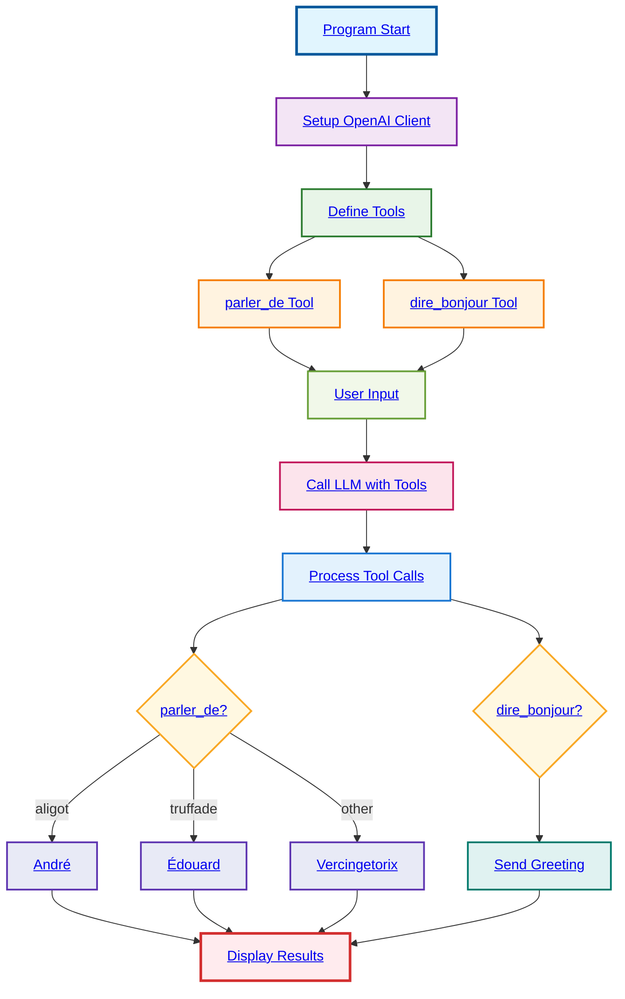

# Function Calling

## Simple Overview

**What it does:**
- Connects to a local AI model
- Defines 2 French language tools
- Processes multiple tool calls in parallel
- Routes responses based on subjects

**Tools:**
1. **parler_de** - Talk about a subject
   - Input: subject name
   - Output: Which expert to consult

2. **dire_bonjour** - Say hello
   - Input: person's name
   - Output: Greeting message

**Key Features:**
- **Parallel Processing**: Multiple tools run at once
- **Subject Routing**: Different experts for different topics
- **French Interface**: Tools and responses in French
- **Local Model**: Uses Docker-based model runner

**Flow:**
1. Load environment settings
2. Create OpenAI client
3. Define tools with parameters
4. Send user message to LLM
5. LLM decides which tools to call
6. Process each tool call
7. Display results

**Example Usage:**
User says: "I want to talk about truffade and say hello to Bob"
→ LLM calls both tools
→ Result: "Talk to Édouard" + "Hello Bob!"