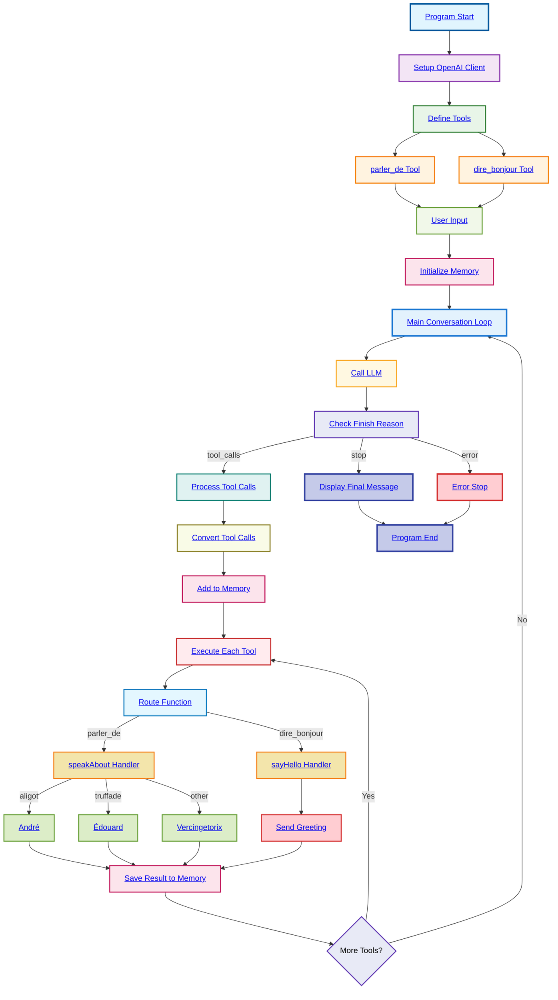

# Function Calling Loop



## Simple Overview

**What it does:**
- Connects to a local AI model with conversation loop
- Defines 2 French language tools (same as basic version)
- Processes tool calls **sequentially** (one by one)
- Maintains conversation memory throughout the process
- Continues until AI says it's finished

**Key Difference from Basic Version:**
- **Sequential Processing**: Tools execute one after another (`ParallelToolCalls: false`)
- **Conversation Loop**: Continues conversation until AI decides to stop
- **Memory Management**: Keeps track of entire conversation history
- **Interactive Flow**: AI can request more tools based on previous results

**Tools:**
1. **parler_de** - Talk about a subject
   - Input: subject name
   - Output: Which expert to consult
   - Implementation: [`speakAbout function`](main.go#L261)

2. **dire_bonjour** - Say hello
   - Input: person's name
   - Output: Greeting message
   - Implementation: [`sayHello function`](main.go#L281)

**Main Loop Process:**
1. **Initialize** conversation memory with user message
2. **Loop until stopped:**
   - Send current conversation to LLM
   - Check LLM's response reason:
     - **tool_calls**: Execute requested tools, add results to memory, continue
     - **stop**: Display final message and exit
     - **error**: Handle error and exit
3. **Memory management**: Every message and result stored for context

**Conversation Flow Example:**
```
User: "I want to talk about truffade and say hello to Bob"
→ LLM: "I'll use parler_de tool with 'truffade'"
→ System: Execute tool → "Talk to Édouard"
→ LLM: "Now I'll use dire_bonjour tool with 'Bob'"
→ System: Execute tool → "Hello Bob!"
→ LLM: "I've completed both requests. Talk to Édouard about truffade and said hello to Bob."
→ System: Stop (conversation complete)
```

**Technical Features:**
- **Sequential Execution**: Tools run one at a time for predictable order
- **Conversation Memory**: Full context preserved across multiple tool calls
- **Error Handling**: Graceful handling of function execution errors
- **Type Safety**: Proper message format conversion for OpenAI API
- **Flexible Termination**: AI decides when conversation is complete